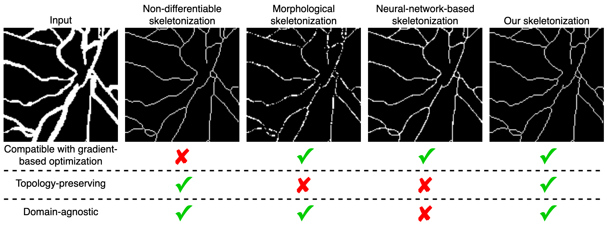

# A skeletonization algorithm for gradient-based optimization

Accompanying code for the paper *A skeletonization algorithm for gradient-based optimization* presented at the International Conference on Computer Vision 2023 [1].

## Introduction

The skeleton of a digital image is a compact representation of its topology, geometry, and scale. It has utility in many computer vision applications, such as image description, segmentation, and registration. However, skeletonization has only seen limited use in contemporary deep learning solutions. Most existing skeletonization algorithms are not differentiable, making it impossible to integrate them with gradient-based optimization. Compatible algorithms based on morphological operations and neural networks have been proposed, but their results often deviate from the geometry and topology of the true medial axis. Our work introduces the first three-dimensional skeletonization algorithm that is both compatible with gradient-based optimization and preserves an object's topology (see figure) [1].



At its core, our method is an iterative boundary-peeling algorithm, which repeatedly removes simple points until only the skeleton remains. Simple points are identified using one of two strategies: one solution relies on the calculation of the Euler characteristic [2], and the other one is based on a set of Boolean rules that evaluate a point's 26-neighborhood [3]. Additionally, we adopt a scheme to safely delete multiple simple points at once, enabling the parallelization of our algorithm and introduce a strategy to apply our algorithm to non-binary inputs by employing the reparametrization trick and a straight-through estimator. The resulting method is exclusively based on matrix additions and multiplications, convolutional operations, basic non-linear functions, and sampling from a uniform probability distribution, allowing it to be easily implemented in PyTorch or any major deep learning library.


## Getting started

The full skeletonization algorithm is contained in `skeletonize.py`. It is implemented as a [PyTorch Module](https://pytorch.org/docs/stable/generated/torch.nn.Module.html) and inherets all its functionalities including its compatibility with PyTorch's automatic differentation engine and the ability to run on graphic processing units. As sucht, the skeletonization algorithm can be easily integrated in neural network architectures and loss functions similar to a convolutional or pooling layer. `demo.py` demonstrates the functionality on a two- and three-dimensional input from the DRIVE [4] and VesSAP [5] dataset, respectively.


## Citation

To cite this work, please use the following BibTeX entry:

```
@inproceedings{Menten2023skeletonization,
  title="A skeletonization algorithm for gradient-based optimization",
  author="Menten, Martin J. and Paetzold, Johannes C. and Zimmer, Veronika A. and Shit, Suprosanna and Ezhov, Ivan and Holland, Robbie and Probst, Monika and Schnabel, Julia A. and Rueckert, Daniel",
  booktitle={Proceedings of the IEEE/CVF International Conference on Computer Vision (ICCV)},
  month={October},
  year={2023}
}
```

## References

[1] Martin J. Menten et al. A skeletonization algorithm for gradient-based optimization. Proceedings of the IEEE/CVF International Conference on Computer Vision (ICCV), 2023.

[2] Steven Lobregt et al. Three-dimensional skeletonization: principle and algorithm. IEEE Transactions on pattern analysis and machine intelligence, 2(1):75–77, 1980

[3] Gilles Bertrand. A boolean characterization of three-dimensional simple points. Pattern recognition letters, 17(2):115-124, 1996

[4] https://drive.grand-challenge.org

[5] https://www.discotechnologies.org/VesSAP